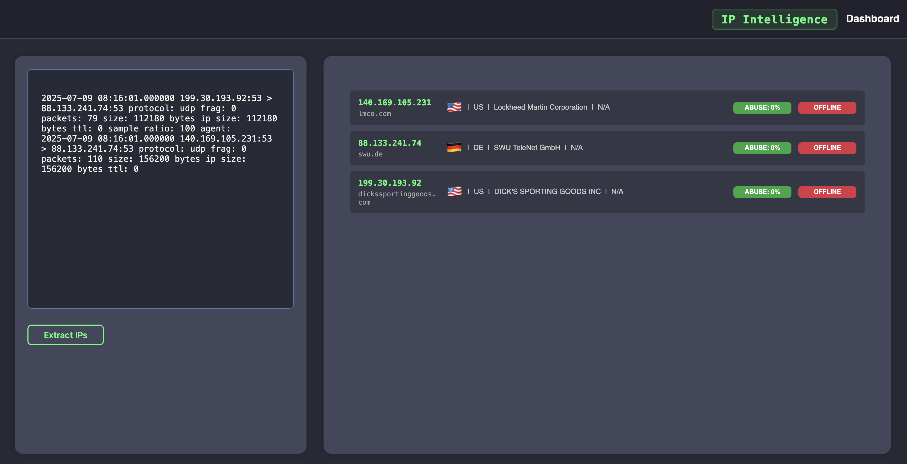

[](https://github.com/Teronisos/ip-intelligence/actions/workflows/docker-image.yml)

# IP Intelligence

Extract IPv4 addresses from logs, perform lookups, and check if they are reachable.  
Lookup information is provided by [abuseipdb.com](https://www.abuseipdb.com/).



---

## Set Environment Variables

### Client

Create `.env` file in `/client/web-ip-intelligence/`:<br>
PORT=4000<br>
REACT_APP_API_URL=NODE_SERVER_ENDPOINT (most of the time the ip of your server)


### Server

Create the `.env.server` file in `/server/`:<br>
token=YOUR_ABUSEDBIP_TOKEN


---

## Run with Docker Compose

Build and start the containers:

```bash
docker-compose build --no-cache
docker-compose up -d
