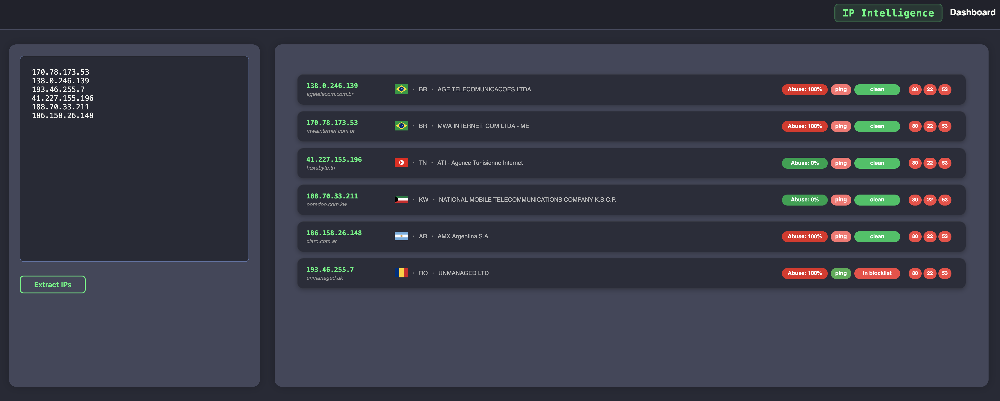

[](https://github.com/Teronisos/ip-intelligence/actions/workflows/docker-compose.yml)


# IP Intelligence

Extract and analyze IPv4 addresses from log files, perform lookups, and verify reachability, abuse scores, and other detailed information.
The platform integrates with [AbuseIPDB](https://www.abuseipdb.com/) to provide detailed threat intelligence for each IP address.


---

## Features
- Extract IPv4 addresses from text using regular expressions
- Basic HTTP, DNS, and SSH port checks
- Blocklist check for suspicious or listed IPs
- Abuse score evaluation from threat intelligence sources
- Lookup of location and hostname information
- Organization details such as ASN, company name, and address
- Reachability verification

---

## Live Demo

Try the online demo: [https://ip-scan.teronisos.tech](https://ip-scan.teronisos.tech)



---

## Installation

### 1. Clone the repository

```bash
git clone https://github.com/Teronisos/ip-intelligence.git
cd ip-intelligence
```

---

## Configuration


### Server configuration

Create a file:

```
/server/.env.server
```

Set:

```bash
token=YOUR_ABUSEDBIP_TOKEN
```

You can obtain an API token by registering at [AbuseIPDB](https://www.abuseipdb.com/).

---
### Client configuration

Create an environment file:

```
/client/web-ip-intelligence/.env
```

Set:

```bash
PORT=4000
REACT_APP_API_URL=NODE_SERVER_ENDPOINT
```

Replace `NODE_SERVER_ENDPOINT` with the server’s API endpoint (for example, the host IP or domain of your backend).

---
## Run with Docker Compose

Build and start the entire stack:

```bash
docker-compose build --no-cache
docker-compose up -d
```

---

## Contact

For questions, feedback, or contributions, please reach out via  
[contact@teronisos.tech](mailto:contact@teronisos.tech)
